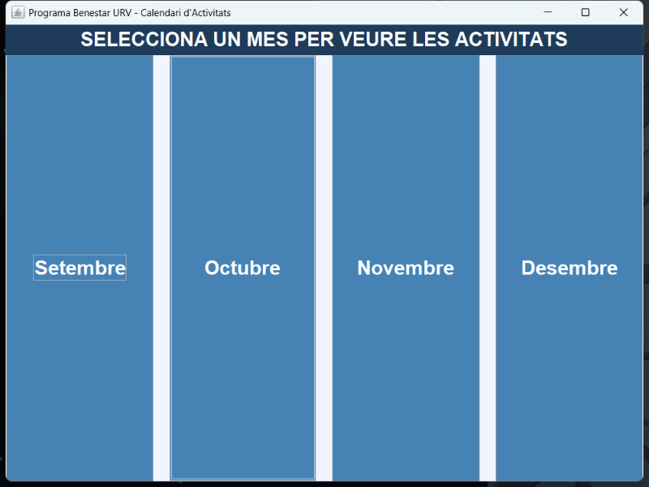
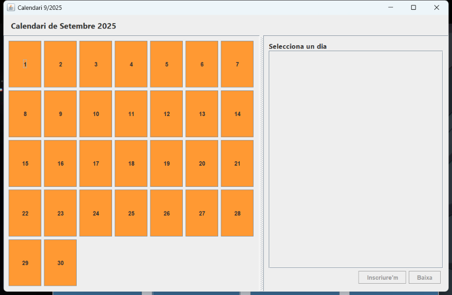

# Gestor de actividades URV

**Asignatura:** programación orientada a objetos · **Trabajo:** grupo de 4 · **Código:** disponible bajo petición

Aplicación de escritorio en Java para gestionar las actividades del programa de bienestar de la universidad. Se puede usar por consola o con interfaz gráfica.

| Ventana principal | Calendario mensual |
|---|---|
|  |  |

## Qué hace

- Actividades de **tres tipos** (de un día, periódicas y en línea) sobre una clase abstracta común.
- Usuarios de **tres colectivos** (estudiantes, PDI y PTGAS) sobre una clase abstracta común.
- **Inscripciones** con control de plazas y **lista de espera**: cuando alguien se da de baja, entra el primero de la lista.
- **Valoraciones** del 0 al 10 y estadísticas por actividad, por usuario y por colectivo.
- Menú de consola con 22 opciones e interfaz **Swing** con calendario mensual.
- **Persistencia** en ficheros de texto y en un fichero binario con objetos serializados.
- Excepciones propias para listas llenas, elementos no encontrados, inscripciones no válidas y valoraciones incorrectas.

## Mi aportación

- **Jerarquía de usuarios**: clase abstracta `Usuari` y subclases `Estudiant`, `PDI` y `PTGAS`, con su formato de email y de fichero y una copia defensiva (`copia()`) para no compartir referencias entre listas.
- **`LlistaUsuaris`**: lista sobre array de tamaño fijo, **ordenada por alias**, con inserción ordenada, búsqueda, eliminación y filtrado por colectivo.
- **`FitxerUsuaris`**: lectura y escritura del fichero de usuarios.
- **Programa de validación** de las clases de usuarios.
- **Ventana principal** de la GUI (selector de mes), junto con otro compañero.

## Tecnologías

Java · Swing · Serialización · POO (herencia, clases abstractas, polimorfismo, excepciones)
